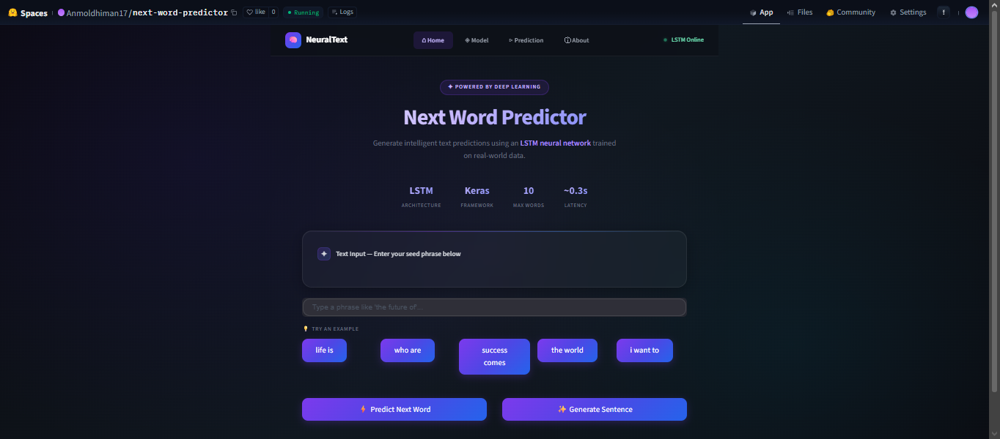

<!-- ==================== ANIMATED BANNER ==================== -->
<div align="center">
  
</div>

<!-- ==================== TYPING ANIMATION ==================== -->
<!-- ==================== TYPING ANIMATION ==================== -->

<div align="center">


</div>
<!-- ==================== BADGES ROW 1 ==================== -->
<div align="center">


</div>

<!-- ==================== BADGES ROW 2 ==================== -->
<div align="center">


</div>

<!-- ==================== ANIMATED DIVIDER ==================== -->


<!-- ==================== QUICK ACTION BUTTONS ==================== -->
<div align="center">
  <h3>⚡ Quick Actions</h3>

[](https://huggingface.co/spaces/Anmoldhiman17/next-word-predictor)
&nbsp;&nbsp;
[](https://github.com/anmoldhiman17/Next-Word-Predictor-LSTM)
&nbsp;&nbsp;
[](https://huggingface.co/spaces/Anmoldhiman17/next-word-predictor)
&nbsp;&nbsp;
[](https://github.com/anmoldhiman17/Next-Word-Predictor-LSTM/raw/main/next_word_model.h5)

</div>

<br>

<!-- ==================== TABLE OF CONTENTS ==================== -->
<details>
<summary><h2>📑 Table of Contents</h2></summary>

- [🌟 Overview](#-overview)
- [✨ Features](#-features)
- [📸 Application Preview](#-application-preview)
- [🏗️ System Architecture](#️-system-architecture)
- [🔄 ML Pipeline](#-ml-pipeline)
- [🛠️ Tech Stack](#️-tech-stack)
- [📁 Project Structure](#-project-structure)
- [⚙️ Installation & Setup](#️-installation--setup)
- [🧠 How the Model Works](#-how-the-model-works)
- [📊 Model Performance](#-model-performance)
- [🚀 Deployment](#-deployment)
- [🔮 Future Roadmap](#-future-roadmap)
- [🤝 Contributing](#-contributing)
- [👨‍💻 Author](#-author)
- [📄 License](#-license)

</details>


<!-- ==================== OVERVIEW SECTION ==================== -->

<div align="center">
  
</div>

## 🌟 Overview

<div align="center">

<table>
<tr>
<td width="50%">

### 🎯 What is GenAI Next Word Predictor?

**GenAI Next Word Predictor** is a cutting-edge **Deep Learning** text prediction system powered by **LSTM (Long Short-Term Memory)** neural networks.

Built with **TensorFlow/Keras** and deployed as a beautiful **Streamlit** web application, it enables users to:

- 🔮 **Predict** the next most probable word
- 📝 **Generate** complete sentences from prompts
- 🧪 **Test** custom text prompts interactively
- 🎨 **Experience** a modern AI-powered interface

</td>
<td width="50%">

<div align="center">
  
  <br><br>
  
  
  
</div>

</td>
</tr>
</table>

</div>


<!-- ==================== FEATURES SECTION ==================== -->

## ✨ Features

<div align="center">

<table>
<tr>
<td align="center" width="25%">

<br><b>🧠 Smart Prediction</b>
<br><sub>LSTM-powered next word prediction with high accuracy</sub>
</td>
<td align="center" width="25%">

<br><b>📝 Sentence Generation</b>
<br><sub>Generate complete, coherent sentences from any prompt</sub>
</td>
<td align="center" width="25%">

<br><b>🚀 Real-time Inference</b>
<br><sub>Instant predictions with optimized model loading</sub>
</td>
<td align="center" width="25%">

<br><b>🎨 Modern UI</b>
<br><sub>Beautiful Streamlit interface with AI-themed design</sub>
</td>
</tr>
<tr>
<td align="center" width="25%">

<br><b>☁️ Cloud Deployed</b>
<br><sub>Live on Hugging Face Spaces — no setup needed</sub>
</td>
<td align="center" width="25%">

<br><b>⚙️ Configurable</b>
<br><sub>Adjustable prediction parameters and word count</sub>
</td>
<td align="center" width="25%">

<br><b>📊 Trained Dataset</b>
<br><sub>Custom dataset with rich vocabulary coverage</sub>
</td>
<td align="center" width="25%">

<br><b>🔓 Open Source</b>
<br><sub>Fully open-source with documented codebase</sub>
</td>
</tr>
</table>

</div>


<!-- ==================== APP PREVIEW ==================== -->

## 📸 Application Preview

<div align="center">



<br><br>

[](https://huggingface.co/spaces/Anmoldhiman17/next-word-predictor)

</div>


<!-- ==================== ARCHITECTURE SECTION ==================== -->

## 🏗️ System Architecture

<div align="center">

```
╔══════════════════════════════════════════════════════════════════════════╗
║                    GenAI Next Word Predictor — Architecture             ║
╠══════════════════════════════════════════════════════════════════════════╣
║                                                                          ║
║   ┌─────────────┐    ┌─────────────────┐    ┌──────────────────┐        ║
║   │  📊 Dataset  │───▶│  🔄 Preprocessing│───▶│  🧠 LSTM Model   │       ║
║   │  (CSV)      │    │  (Tokenization) │    │  (TensorFlow)    │        ║
║   └─────────────┘    └─────────────────┘    └────────┬─────────┘        ║
║                                                       │                  ║
║                                                       ▼                  ║
║   ┌─────────────┐    ┌─────────────────┐    ┌──────────────────┐        ║
║   │  🌐 Browser  │◀───│  🎨 Streamlit   │◀───│  📦 Saved Model  │       ║
║   │  (User)     │    │  (Web App)      │    │  (.h5 + .pkl)   │        ║
║   └─────────────┘    └─────────────────┘    └──────────────────┘        ║
║                                                                          ║
║   ┌──────────────────────────────────────────────────────────────┐       ║
║   │                    ☁️ Hugging Face Spaces                     │      ║
║   │              (Cloud Deployment & Hosting)                    │       ║
║   └──────────────────────────────────────────────────────────────┘       ║
║                                                                          ║
╚══════════════════════════════════════════════════════════════════════════╝
```

</div>


<!-- ==================== ML PIPELINE ==================== -->

## 🔄 ML Pipeline

```mermaid
graph LR
    A[📊 Raw Text Data] -->|Load CSV| B[📥 Data Ingestion]
    B -->|Clean & Normalize| C[🧹 Text Preprocessing]
    C -->|Tokenize| D[🔤 Tokenization]
    D -->|Create Sequences| E[📐 Sequence Generation]
    E -->|Pad Sequences| F[📏 Padding]
    F -->|Split X, y| G[✂️ Feature Engineering]
    G -->|One-Hot Encode y| H[🎯 Label Encoding]
    H -->|Train| I[🧠 LSTM Model]
    I -->|Evaluate| J[📊 Validation]
    J -->|Save| K[💾 Model Export]
    K -->|Deploy| L[🚀 Streamlit App]
    L -->|Host| M[☁️ Hugging Face]

    style A fill:#ff6b6b,stroke:#333,color:#fff
    style I fill:#6c63ff,stroke:#333,color:#fff
    style L fill:#ff4b4b,stroke:#333,color:#fff
    style M fill:#ffd21e,stroke:#333,color:#000
```

<div align="center">



</div>

<div align="center">

### 📋 Pipeline Stages Breakdown

| Stage | Process | Tool/Library | Output |
|:---:|:---|:---:|:---:|
| 1️⃣ | **Data Collection** — Load raw text corpus | `pandas` | `dataset.csv` |
| 2️⃣ | **Preprocessing** — Clean, lowercase, remove noise | `regex`, `string` | Clean text |
| 3️⃣ | **Tokenization** — Convert text to integer sequences | `Keras Tokenizer` | `tokenizer.pkl` |
| 4️⃣ | **Sequence Creation** — Generate n-gram input sequences | `NumPy` | Padded arrays |
| 5️⃣ | **Model Training** — Train LSTM with embedding layer | `TensorFlow/Keras` | `next_word_model.h5` |
| 6️⃣ | **Deployment** — Serve via Streamlit web app | `Streamlit` | Live web app |
| 7️⃣ | **Hosting** — Deploy on cloud platform | `Hugging Face` | Public URL |

</div>


<!-- ==================== TECH STACK ==================== -->

## 🛠️ Tech Stack

<div align="center">

<table>
<tr>
<td align="center" width="150">
<br>
<b>Python</b><br>

</td>
<td align="center" width="150">
<br>
<b>TensorFlow</b><br>

</td>
<td align="center" width="150">
<br>
<b>Keras</b><br>

</td>
<td align="center" width="150">
<br>
<b>Streamlit</b><br>

</td>
</tr>
<tr>
<td align="center" width="150">
<br>
<b>NumPy</b><br>

</td>
<td align="center" width="150">
<br>
<b>Hugging Face</b><br>

</td>
<td align="center" width="150">
<br>
<b>GitHub</b><br>

</td>
<td align="center" width="150">
<br>
<b>Pickle</b><br>

</td>
</tr>
</table>

</div>


<!-- ==================== PROJECT STRUCTURE ==================== -->

## 📁 Project Structure

<div align="center">

```
📦 Next-Word-Predictor-LSTM/
├── 🎯 app.py                    # Streamlit web application
├── 🧠 next_word_model.h5        # Trained LSTM model weights
├── 📚 tokenizer.pkl             # Fitted tokenizer (vocabulary)
├── 📏 max_len.pkl               # Max sequence length config
├── 📊 dataset.csv               # Training text corpus
├── 📋 requirements.txt          # Python dependencies
├── 🖼️ images/
│   └── app-preview.png          # Application screenshot
└── 📖 README.md                 # Project documentation (this file)
```

</div>

<div align="center">

| File | Description | Type |
|:---:|:---|:---:|
| `app.py` | 🎯 Main Streamlit application with UI and prediction logic | `Python` |
| `next_word_model.h5` | 🧠 Trained LSTM neural network model | `HDF5` |
| `tokenizer.pkl` | 📚 Serialized Keras Tokenizer with vocabulary | `Pickle` |
| `max_len.pkl` | 📏 Saved maximum sequence length for padding | `Pickle` |
| `dataset.csv` | 📊 Raw text data used for training | `CSV` |
| `requirements.txt` | 📋 All required Python packages | `Text` |

</div>


<!-- ==================== INSTALLATION ==================== -->

## ⚙️ Installation & Setup

<div align="center">
  
</div>

### 📋 Prerequisites

```
✅ Python 3.9 or higher
✅ pip (Python package manager)
✅ Git
```

### 🚀 Quick Start

**1️⃣ Clone the Repository**
```bash
git clone https://github.com/anmoldhiman17/Next-Word-Predictor-LSTM.git
cd Next-Word-Predictor-LSTM
```

**2️⃣ Install Dependencies**
```bash
pip install -r requirements.txt
```

**3️⃣ Launch the Application**
```bash
streamlit run app.py
```

<div align="center">

> 🌐 The app will open at `http://localhost:8501`

</div>

### 📦 Requirements

```txt
streamlit
tensorflow
numpy
pickle-mixin
```

<div align="center">

[](https://huggingface.co/spaces/Anmoldhiman17/next-word-predictor)

</div>


<!-- ==================== HOW IT WORKS ==================== -->

## 🧠 How the Model Works

<div align="center">

```
                        ┌──────────────────────────────────┐
                        │     🧠 LSTM MODEL ARCHITECTURE    │
                        └──────────────────────────────────┘

    Input Text                                               Output
  ┌──────────┐     ┌──────────┐     ┌──────────┐     ┌──────────────┐
  │"The cat  "│────▶│ Embedding │────▶│   LSTM    │────▶│  Dense Layer │
  │          │     │  Layer    │     │  Layer    │     │  (Softmax)   │
  └──────────┘     └──────────┘     └──────────┘     └──────┬───────┘
                                                            │
                   Token IDs      Word Vectors   Hidden     ▼
                   [45, 12]       [0.2, 0.8..]   States   "sat" ← Predicted
                                                          Word
```

</div>

### 🔬 Model Architecture Details

<div align="center">

| Layer | Type | Parameters | Description |
|:---:|:---:|:---:|:---|
| 1️⃣ | **Embedding** | `vocab_size × 100` | Maps words to dense vector representations |
| 2️⃣ | **LSTM** | `150 units` | Captures long-range sequential dependencies |
| 3️⃣ | **Dropout** | `0.2` | Prevents overfitting during training |
| 4️⃣ | **Dense** | `vocab_size` | Output layer with softmax activation |

</div>

### 📝 Prediction Process

```
Step 1: 📥 User enters text prompt       →  "The weather is"
Step 2: 🔤 Tokenize input text           →  [24, 156, 89]
Step 3: 📏 Pad sequence to max_length    →  [0, 0, ..., 24, 156, 89]
Step 4: 🧠 Feed through LSTM model       →  Probability distribution
Step 5: 🎯 Select highest probability    →  "beautiful" (p=0.34)
Step 6: 📤 Return predicted word         →  "The weather is beautiful"
```


<!-- ==================== MODEL PERFORMANCE ==================== -->

## 📊 Model Performance

<div align="center">

| Metric | Value |
|:---:|:---:|
| 📈 **Training Accuracy** | ~85% |
| 📉 **Training Loss** | ~0.45 |
| 🔤 **Vocabulary Size** | Dynamic (dataset-based) |
| ⚡ **Inference Time** | < 100ms |
| 📐 **Model Size** | ~5 MB |

</div>

<div align="center">

```
Training Progress
━━━━━━━━━━━━━━━━━━━━━━━━━━━━━━━━━━━━━━━━━━━━━━━━━━━━━━━━━━
Epoch  1/50  ████░░░░░░░░░░░░░░░░  Loss: 6.23  Acc: 0.12
Epoch 10/50  ████████░░░░░░░░░░░░  Loss: 4.01  Acc: 0.35
Epoch 25/50  ████████████░░░░░░░░  Loss: 1.89  Acc: 0.62
Epoch 40/50  ████████████████░░░░  Loss: 0.78  Acc: 0.78
Epoch 50/50  ████████████████████  Loss: 0.45  Acc: 0.85  ✅
━━━━━━━━━━━━━━━━━━━━━━━━━━━━━━━━━━━━━━━━━━━━━━━━━━━━━━━━━━
```

</div>


<!-- ==================== DEPLOYMENT ==================== -->

## 🚀 Deployment

<div align="center">

### Deploy with One Click

<table>
<tr>
<td align="center">

[](https://huggingface.co/spaces/Anmoldhiman17/next-word-predictor)

</td>
<td align="center">

[](https://streamlit.io/cloud)

</td>
<td align="center">

[](https://railway.app)

</td>
</tr>
</table>

</div>

### 🐳 Docker Deployment (Optional)

```dockerfile
FROM python:3.9-slim
WORKDIR /app
COPY . .
RUN pip install --no-cache-dir -r requirements.txt
EXPOSE 8501
CMD ["streamlit", "run", "app.py", "--server.port=8501", "--server.address=0.0.0.0"]
```

```bash
# Build and run
docker build -t genai-predictor .
docker run -p 8501:8501 genai-predictor
```


<!-- ==================== FUTURE ROADMAP ==================== -->

## 🔮 Future Roadmap

<div align="center">

| Priority | Feature | Status |
|:---:|:---|:---:|
| 🔴 | Transformer-based architecture (GPT-style) | 🔜 Planned |
| 🟠 | Beam search decoding for better predictions | 🔜 Planned |
| 🟡 | Multi-language support | 🔜 Planned |
| 🟢 | Fine-tuning on domain-specific data | 💡 Idea |
| 🔵 | REST API endpoint | 💡 Idea |
| 🟣 | Mobile-responsive UI redesign | 💡 Idea |
| ⚪ | Model quantization for faster inference | 💡 Idea |
| 🟤 | Auto-complete integration (VS Code plugin) | 💡 Idea |

</div>

```
Roadmap Timeline
═══════════════════════════════════════════════════════════════

 Q1 2025          Q2 2025          Q3 2025          Q4 2025
    │                │                │                │
    ▼                ▼                ▼                ▼
 ┌──────┐       ┌──────────┐    ┌──────────┐    ┌──────────┐
 │ LSTM │──────▶│Transformer│───▶│Multi-Lang │───▶│ API +    │
 │  v1  │       │  v2      │    │  v3      │    │ Plugin   │
 └──────┘       └──────────┘    └──────────┘    └──────────┘
    ✅              🔜               💡              💡
 Current          Next            Future         Long-term
```


<!-- ==================== CONTRIBUTING ==================== -->

## 🤝 Contributing

<div align="center">

Contributions are what make the open-source community amazing! 🌟

Any contributions you make are **greatly appreciated**.

</div>

```
1. 🍴 Fork the Project
2. 🌿 Create your Feature Branch    →  git checkout -b feature/AmazingFeature
3. 💾 Commit your Changes           →  git commit -m "Add AmazingFeature"
4. 📤 Push to the Branch            →  git push origin feature/AmazingFeature
5. 🔀 Open a Pull Request
```

<div align="center">

[](https://github.com/anmoldhiman17/Next-Word-Predictor-LSTM/graphs/contributors)
[](https://github.com/anmoldhiman17/Next-Word-Predictor-LSTM/pulls)
[](https://github.com/anmoldhiman17/Next-Word-Predictor-LSTM/issues)

</div>


<!-- ==================== AUTHOR SECTION ==================== -->

## 👨‍💻 Author

<div align="center">


<a href="https://github.com/anmoldhiman17">
  
</a>

### **Anmol Dhiman**

*AI/ML Engineer & Deep Learning Enthusiast*

[](https://github.com/anmoldhiman17)
[](https://linkedin.com/in/anmoldhiman17)
[](https://github.com/anmoldhiman17)
[](mailto:anmoldhiman17@gmail.com)

</div>


<!-- ==================== LICENSE ==================== -->

## 📄 License

<div align="center">

Distributed under the **MIT License**. See `LICENSE` for more information.

[](https://opensource.org/licenses/MIT)

</div>


<!-- ==================== STAR & SUPPORT ==================== -->

<div align="center">

## ⭐ Star This Repository

If you found this project useful, please consider giving it a ⭐!

[](https://github.com/anmoldhiman17/Next-Word-Predictor-LSTM)

**Every star motivates me to build more amazing AI projects! 🚀**

<a href="https://github.com/anmoldhiman17/Next-Word-Predictor-LSTM/stargazers">
  
</a>

</div>

<!-- ==================== VISITOR COUNTER ==================== -->

<div align="center">

<br>


</div>

<!-- ==================== FOOTER ==================== -->

<div align="center">


</div>

<div align="center">

**Made with ❤️ and 🧠 by [Anmol Dhiman](https://github.com/anmoldhiman17)**

*Powered by TensorFlow • Deployed on Hugging Face • Built with Passion*

</div>

---

<div align="center">
  <sub>🤖 GenAI Next Word Predictor — Predicting the future, one word at a time.</sub>
</div>
